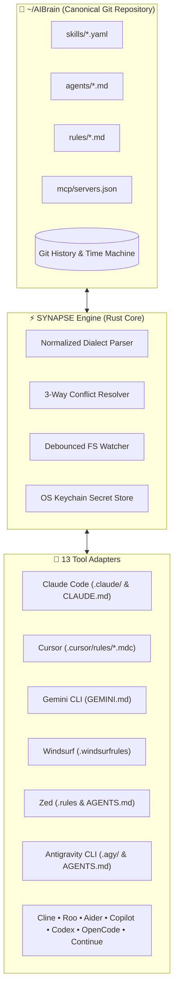
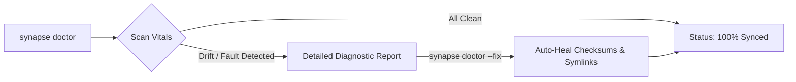

<div align="center">


# SYNAPSE
### Your Local, Privacy-First "LLM Neuro-Surgeon"
**One Brain. All Models. Permanent Lockstep.** — 100% local execution, zero telemetry, fully open-source (MIT), every line auditable.

[](https://earnerbaymalay.github.io/)
[](https://github.com/earnerbaymalay/synapse/actions)
[](packages/e2e/)
[](packages/core/)
[](https://github.com/earnerbaymalay/synapse/releases)
[](LICENSE)
[](https://github.com/earnerbaymalay/synapse)
[](docs/security.md)
[](docs/security.md)
[](https://www.rust-lang.org/)
[](https://v2.tauri.app/)
[](docs/packaging/RELEASE_PACKAGING.md)

**[🌐 Live Site](https://earnerbaymalay.github.io/)** • **[🔒 Privacy & Safety](#-privacy--safety-by-design)** • **[⚡ Quickstart](#-60-second-quickstart)** • **[🔌 13 Adapters](#-13-verified-tool-adapters)** • **[🏛️ Architecture](#%EF%B8%8F-architecture--mental-model)** • **[💻 Desktop App](#-desktop-gui-application)** • **[🩺 The Doctor](#-the-doctor-self-healing-configurations)** • **[📚 Docs Hub](docs/README.md)**

---

</div>

## 📑 Table of Contents

- [💡 What is SYNAPSE?](#-what-is-synapse)
  - [Clinical Operating Identity](#-clinical-operating-identity)
  - [Terminal Walkthrough](#-terminal-walkthrough)
- [⚡ 60-Second Quickstart](#-60-second-quickstart)
- [🏛️ Architecture & Mental Model](#%EF%B8%8F-architecture--mental-model)
- [🔌 13 Verified Tool Adapters](#-13-verified-tool-adapters)
- [⚡ Synaptic Sensory Gating: 95% Agent Token Auto-Compression](#-synaptic-sensory-gating-95-agent-token-auto-compression)
- [📓 Auto-Bundled Obsidian Session Worklog Skill](#-auto-bundled-obsidian-session-worklog-skill)
- [💻 Desktop GUI Application](#-desktop-gui-application)
- [🩺 The Doctor: Self-Healing Configurations](#-the-doctor-self-healing-configurations)
- [🔐 Security & Threat Model](#-security--threat-model)
- [📦 Multi-Platform Installation](#-multi-platform-installation)
- [🧪 Test & Verification Metrics](#-test--verification-metrics)
- [📚 Documentation Index](#-documentation-index)
- [🤝 Contributing & Community](#-contributing--community)
- [📄 License](#-license)

---

## 💡 What is SYNAPSE?

**SYNAPSE** — your local, privacy-first "LLM Neuro-Surgeon" — is the open-source configuration engine and synchronizer that keeps Claude Code, Cursor, Gemini CLI, Windsurf, Zed, and 8+ other AI coding companions in permanent lockstep.

AI coding tools each invent their own idiosyncratic configuration locations and formats (`CLAUDE.md`, `.cursorrules`, `.windsurfrules`, `.gemini/settings.json`, `.continue/rules/`). When you refine a skill or update an MCP server in one assistant, your other tools fall out of sync. **SYNAPSE eliminates prompt drift by establishing a single canonical Git-backed Brain (`~/AIBrain`) and losslessly translating your rules to all 13 tools — entirely on your machine.**

### 🔒 Privacy & Safety by Design

Your AI tooling config touches every API key and every rule you've written — SYNAPSE treats that as something to protect, not collect:

| Guarantee | What it means |
|---|---|
| **100% Local Execution** | Every scan, import, and projection runs on-device. No API calls, no sync servers, no round-trips. |
| **Zero Telemetry** | No phone-home calls, no usage tracking, no crash reporting to a third party — verifiable in the source. |
| **OS Keychain Secrets** | API keys live in `libsecret` / macOS Keychain / Credential Manager. Projected configs only ever hold `${ENV_VAR}` references — raw secrets are never written to plaintext. |
| **Fully Open Source** | MIT licensed, every line of the Rust core and every adapter auditable on GitHub — no closed-source binary blobs. |
| **Pre-op Snapshots & Rollback** | Nothing is written without a dry-run preview first, and every change ships with an instant undo path. |

Full detail in the **[Security & Threat Model Audit](docs/security.md)**.

### 🩺 Clinical Operating Identity
A developer's AI tooling environment is treated like a vital clinical system:

| Role | Entity | Description |
|---|---|---|
| **The Organ** | `~/AIBrain` | The single, Git-backed canonical source of truth holding every skill, rule, agent, and MCP server. |
| **The Grafts** | **13 Adapters** | Lossless bi-directional translators projecting canonical rules into each tool's native dialect. |
| **The Surgeon** | `synapse` | Accountable for every modification — with dry-run verification, pre-op snapshots, and instant rollbacks. |
| **The Doctor** | `synapse doctor` | Continuous diagnostic self-healing to detect configuration drift and heal broken symlinks. |

### 🖥️ Terminal Walkthrough

```text
$ synapse scan
[SCAN] Discovered 5 active AI tools on workstation:
  ✔ Claude Code        (~/.claude, ./CLAUDE.md)
  ✔ Cursor             (./.cursorrules, ./.cursor/rules/)
  ✔ Gemini CLI         (~/.gemini, ./GEMINI.md)
  ✔ Windsurf           (~/.codeium/windsurf, ./.windsurfrules)
  ✔ Antigravity CLI    (~/.agy, ./AGENTS.md)

$ synapse import --dry-run
[DRY-RUN] Ingestion Preview -> ~/AIBrain:
  + 14 skills detected across Claude and AGY
  + 6 MCP server definitions harvested into OS Keychain
  + 0 destructive writes (Dry Run Mode)

$ synapse project
[PROJECT] Projecting canonical Brain to 13 targets:
  ✔ CLAUDE.md (stamped)
  ✔ .cursor/rules/ (projected 14 MDC rules)
  ✔ GEMINI.md (stamped)
  ✔ .windsurfrules (stamped)
  ✔ AGENTS.md (synced)
[OK] All tools synchronized in 12ms.
```

---

## ⚡ 60-Second Quickstart

Get your workstation synchronized in three steps:

```bash
# 1. Detect active AI coding tools on your workstation
synapse scan

# 2. Ingest configurations into ~/AIBrain (Git-backed repository)
synapse import --dry-run
synapse import

# 3. Project Brain configurations out to all tools, then reconcile drift
synapse project
synapse sync
```

> [!TIP]
> You can also run the CLI via Cargo in development: `cargo run -p synapse -- scan`.

For system prerequisites and platform-specific details across Linux, macOS, and Windows, read the **[Quickstart Guide](docs/QUICKSTART.md)**.

---

## 🏛️ Architecture & Mental Model

SYNAPSE operates on a star-topology with `~/AIBrain` at the core. Canonical rules, skills, agents, and MCP definitions are parsed into a normalized schema and projected outward via dialect-specific adapters.



---

## 🔌 13 Verified Tool Adapters

Every adapter is verified with boundary, stress, and roundtrip tests in our CI matrix:

| Tool | Specification | Config Location | Format | Import Capabilities | Projection Dialect |
|---|---|---|---|---|---|
| **Claude Code / Desktop** | [Spec](docs/adapters/claude.md) | `CLAUDE.md`, `.claude/skills/`, `.mcp.json` | Markdown, JSON | Skills, Agents, MCP Servers | Stamped `CLAUDE.md` + `.claude/` |
| **Cursor** | [Spec](docs/adapters/cursor.md) | `.cursorrules`, `.cursor/rules/*.mdc` | MDC Frontmatter | MDC Rules & Globs | `.cursor/rules/*.mdc` |
| **Gemini CLI** | [Spec](docs/adapters/gemini.md) | `GEMINI.md`, `.gemini/settings.json` | Markdown, JSON | Rules, Settings | Stamped `GEMINI.md` |
| **Windsurf** | [Spec](docs/adapters/windsurf.md) | `.windsurfrules`, `mcp_config.json` | Text, JSON | Rules & MCP Servers | Stamped `.windsurfrules` |
| **Cline** | [Spec](docs/adapters/cline.md) | `.clinerules`, `cline_mcp_settings.json` | Text, JSON | Custom Rules & MCP | Stamped `.clinerules` |
| **Roo Code** | [Spec](docs/adapters/roo-code.md) | `.roomodes`, `.clinerules` | JSON, Text | Mode Rules | Stamped `.roomodes` |
| **Aider** | [Spec](docs/adapters/aider.md) | `CONVENTIONS.md`, `.aider.conf.yml` | Markdown, YAML | Conventions & Config | Stamped `CONVENTIONS.md` |
| **Continue** | [Spec](docs/adapters/continue.md) | `.continue/rules/*.md`, `.continue/config.json` | MDC, JSON | MDC Rules & Config | `.continue/rules/*.md` |
| **GitHub Copilot** | [Spec](docs/adapters/github-copilot.md) | `.github/copilot-instructions.md` | Markdown | Scoped Instructions | Stamped Instructions |
| **Zed** | [Spec](docs/adapters/zed.md) | `.rules`, `.zed/settings.json`, `AGENTS.md` | Text, JSON, MD | Settings & Rules | `.rules` + `AGENTS.md` |
| **OpenAI Codex CLI** | [Spec](docs/adapters/openai-codex.md) | `.codex/config.toml`, `.codex/instructions.md` | TOML, Markdown | Rules, Config | `AGENTS.md` + `.codex/` |
| **OpenCode** | [Spec](docs/adapters/opencode.md) | `AGENTS.md` | Markdown | Multi-Agent Rules | Stamped `AGENTS.md` |
| **Antigravity CLI (AGY)** | [Spec](docs/adapters/antigravity.md) | `AGENTS.md`, `.agy/skills/`, `.gemini/` | Markdown, YAML | Skills & Settings | `AGENTS.md` + `.agy/skills/` |

---

## ⚡ Synaptic Sensory Gating: 95% Agent Token Auto-Compression

AI coding agents frequently execute verbose CLI commands (`cargo test`, `vitest`, `pytest`, `npm build`, linters) that dump thousands of lines of repetitive noise into the agent's context window. This exhausts context limits, degrades model reasoning, and inflates API costs.

**Synapse Synaptic Compression** introduces local sensory gating:
- **Noise Elimination**: Collapses hundreds of passing test lines into concise milestones (e.g. `✔ 230 tests passed in 1.4s`).
- **Signal Fidelity**: Preserves **100%** of errors, stack traces, compiler diagnostics, and failure assertions.
- **Local Spooling**: Automatically saves the full uncompressed log to `~/.synapse/spool/<id>.log` for on-demand retrieval (`synapse spool show <id>`).

```bash
# Execute arbitrary agent commands with real-time compression
synapse exec -- cargo test --workspace
synapse exec -- pnpm test:e2e
synapse exec -- npm run build

# Stream stdin through the filter
cargo test 2>&1 | synapse filter --level aggressive

# Inspect spooled raw execution logs
synapse spool list
synapse spool show 62500885 --grep "error"
```

| Execution Type | Raw Context | Synapse Context | Token Reduction | Preserved Information |
|---|---|---|---|---|
| `cargo test --workspace` (230 tests) | ~8,400 tokens | **~240 tokens** | **97.1%** | All failure assertions, panic traces, summary line |
| `vitest run` (142 tests) | ~6,200 tokens | **~190 tokens** | **96.9%** | Failed test names, code frame diffs, runtime stats |
| `npm install / build` | ~4,500 tokens | **~140 tokens** | **96.8%** | Audit warnings, build errors, asset sizes |
| `docker build` | ~12,000 tokens | **~420 tokens** | **96.5%** | Step statuses, layer caching flags, compilation errors |

---

## 📓 Auto-Bundled Obsidian Session Worklog Skill

Every install of SYNAPSE comes with the canonical **Obsidian Session Worklog Skill** auto-provisioned inside `~/AIBrain/skills/obsidian-session-worklog/` and projected outward across all tools.

### Why It Matters
AI coding sessions are often ephemeral. Context, architectural trade-offs, and verification test logs are lost when a chat ends. With this skill enabled, AI assistants automatically:
1. **Discover your Obsidian Vault**: Auto-locates `$OBSIDIAN_VAULT_PATH` or `~/Documents/My-Vault`.
2. **Log Session Milestones**: Automatically writes session worklogs to `${VAULT}/Worklog/AGY Sessions/YYYY-MM-DD - AI Session - ${CONVERSATION_ID}.md`.
3. **Sync Project Checklists**: Keeps `${VAULT}/Projects/${PROJECT_NAME}/Repository To-Do.md` in lockstep with completed milestones and git commits.

```text
~/AIBrain/skills/obsidian-session-worklog/
├── SKILL.md        # Canonical skill definition & Obsidian vault templates
└── skill.yaml      # Multi-tool projection metadata & trigger configuration
```

---

## 💻 Desktop GUI Application

In addition to the high-speed CLI, SYNAPSE includes a cross-platform desktop dashboard built with **Tauri v2 + React 18** and styled with the **SYNAPSE Dark Precision Design System** (`#090d16` background, `#1d9bf0` synapse accent, sharp geometric borders, zero emojis).

```text
┌────────────────────────────────────────────────────────────────────────┐
│  SYNAPSE // Privacy-First LLM Neuro-Surgeon                    v1.0.0 │
├───────────────┬────────────────────────────────────────────────────────┤
│ [Dashboard]   │  SYNAPSE DASHBOARD — One Brain. All Models.             │
│ [Config]      │  ┌──────────────────┐ ┌────────────────┐ ┌────────────┐ │
│ [Adapters]    │  │ 13 Adapters      │ │ ~/AIBrain      │ │ Status: OK │ │
│ [Vitals]      │  └──────────────────┘ └────────────────┘ └────────────┘ │
│ [CLI & Debug] │  Active Targets:                                       │
│ [Onboarding]  │  • synapse                         [SYNAPSE IN SYNC]   │
│ [Marketplace] │  • anthropics-skills-bundle       [13 SKILLS LOADED]  │
│ [MCP Hub]     │  • OS Keychain Secrets             [6 TOKENS LOCKED]   │
└───────────────┴────────────────────────────────────────────────────────┘
```

### Desktop App Features
- 📊 **Unified Vitals & Drift Monitor**: Live visual feed of configuration drift and file integrity.
- 🔑 **MCP Secrets Hub**: Visual vault for managing MCP server connections and OS Keychain credentials.
- 📦 **Skill Marketplace**: Browse and ingest skills from public bundles directly into `~/AIBrain`.
- 🧭 **4-Phase Onboarding**: Interactive wizard guiding new setups from scan to background daemon sync.

To run the Desktop GUI in development:
```bash
pnpm install
pnpm --filter desktop-app tauri dev
```

---

## 🩺 The Doctor: Self-Healing Configurations

When tool configurations drift, symlinks break, or projection stamps are modified directly, Synapse detects and repairs the issue automatically:

```bash
# Diagnose configuration drift & broken symlinks
synapse doctor

# Apply automatic remediation
synapse doctor --fix
```



---

## 🔐 Security & Threat Model

SYNAPSE is built from the ground up for strict local isolation and zero data leakage:

- 🛡️ **Zero Telemetry**: SYNAPSE performs **zero** phone-home calls, usage tracking, or cloud uploads. Everything executes 100% locally.
- 🔑 **OS Keychain Integration**: API keys and tokens are stored in the OS Keychain (`libsecret` on Linux, Keychain on macOS, Credential Manager on Windows). Projected configs only use `${ENV_VAR}` references—**raw secrets are never written to plaintext files**.
- 🚫 **Path Traversal Defense**: All adapter write paths are strictly bounded inside designated workspace/brain directories to prevent directory traversal attacks.

Read the full **[Security & Threat Model Audit](docs/security.md)** for details.

---

## 📦 Multi-Platform Installation

### 1. Pre-built Release Packages

Download verified release binaries for your operating system from the **[GitHub Releases](https://github.com/earnerbaymalay/synapse/releases)** page:

| Operating System | Package Format | Installation |
|---|---|---|
| **Linux (Ubuntu/Debian)** | `.deb` / Binary | `sudo dpkg -i synapse_1.0.0_amd64.deb` |
| **macOS (Apple Silicon & Intel)** | `.dmg` / Binary | Open `.dmg` and drag `Synapse` to Applications |
| **Windows** | `.msi` / `.exe` | Run `Synapse_1.0.0_x64_en-US.msi` installer |

### 2. Building From Source (Cargo)

```bash
# Install Rust toolchain (1.75+)
curl --proto '=https' --tlsv1.2 -sSf https://sh.rustup.rs | sh

# Clone repository & build
git clone https://github.com/earnerbaymalay/synapse.git
cd synapse
cargo build --release -p synapse

# Binary is available at:
./target/release/synapse --version
```

---

## 🧪 Test & Verification Metrics

SYNAPSE enforces a 100% test pass requirement across all CI tiers:

```text
┌────────────────────────────────────────────────────────────────────────┐
│  TEST SUITE EXECUTION SUMMARY                                          │
├───────────────────────────────────────────────────┬────────────────────┤
│  Rust Workspace Unit & Stress Tests (Cargo)       │  225/225 PASSED    │
│  Sanity Vitest Suite                              │    4/4   PASSED    │
│  Tier 1: Happy-Path Feature Coverage Vitest Suite │   60/60  PASSED    │
│  Tier 2: Boundary & Corner Cases Vitest Suite     │   60/60  PASSED    │
│  Tier 3: Combinations & State Transitions Suite   │   12/12  PASSED    │
│  Tier 4: Real-World Workloads & E2E Scenarios     │    6/6   PASSED    │
│  Desktop React Component Tests                    │   10/10  PASSED    │
├───────────────────────────────────────────────────┼────────────────────┤
│  TOTAL COMBINED PASS RATE                         │  377/377 (100%)    │
│  Clippy Warnings & Lints                          │  0 Warnings        │
└───────────────────────────────────────────────────┴────────────────────┘
```

---

## 📚 Documentation Index

| Guide | Description | Target Audience |
|---|---|---|
| **[Docs Hub](docs/README.md)** | Centralized documentation navigation & command index | All users & contributors |
| **[Quickstart Guide](docs/QUICKSTART.md)** | Step-by-step setup in under 60 seconds | First-time evaluators |
| **[User Guide](docs/USER_GUIDE.md)** | Day-to-day workflow, sync reconciliation, MCP hub & Doctor self-healing | Daily development |
| **[Onboarding Journey](docs/ONBOARDING.md)** | 4-phase journey from fragmented configs to permanent lockstep | Getting started |
| **[Architecture Blueprint](docs/ARCHITECTURE.md)** | 3-way merge engine & monorepo layout | Core engine developers |
| **[Adapters Hub](docs/adapters/README.md)** | Complete matrix and individual adapter specifications | Tool dialect reference |
| **[Adapter Authoring Guide](docs/ADAPTER_AUTHORING_GUIDE.md)** | Step-by-step guide to authoring a new Rust tool adapter | Tool integrators |
| **[Security & Threat Model](docs/security.md)** | Threat model, path traversal defense, and OS Keychain audit | Security & compliance |
| **[Contributing Guide](docs/development/CONTRIBUTING.md)** | PR lifecycle, test requirements & coding standards | Open source contributors |
| **[Release Packaging](docs/packaging/RELEASE_PACKAGING.md)** | Tauri v2 desktop installers (.deb, .dmg, .msi) & scripts | Release engineering |

---

## 🤝 Contributing & Community

Contributions are warmly welcomed! To get started:

1. Fork the repository on [GitHub](https://github.com/earnerbaymalay/synapse).
2. Read the **[Contributing Guidelines](docs/development/CONTRIBUTING.md)** and **[Adapter Authoring Guide](docs/ADAPTER_AUTHORING_GUIDE.md)**.
3. Run `cargo test --workspace` and `pnpm test` to ensure all tests pass.
4. Submit a Pull Request.

---

## 📄 License

This project is licensed under the **MIT License** — see the [LICENSE](LICENSE) file for details.

<div align="center">
<sub>Built with Rust, Tauri 2, and React. Zero telemetry. Offline first.</sub>
</div>

