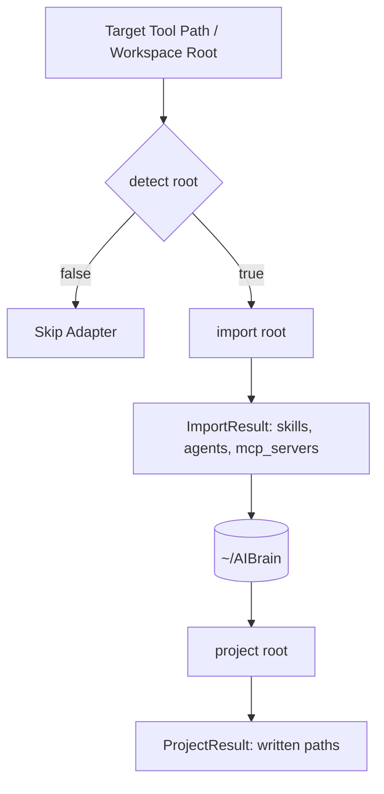

# Adapter Authoring Guide — SYNAPSE
### llm-neuro-surgeon — Building Tool Adapters in Rust

This guide explains how to author a new tool adapter for SYNAPSE. Tool adapters allow SYNAPSE to losslessly ingest and project configurations for any AI coding tool.

---

## Table of Contents

1. [Adapter Architecture & Contract](#1-adapter-architecture--contract)
2. [The `Adapter` Trait in Rust](#2-the-adapter-trait-in-rust)
3. [Implementing the Three Methods](#3-implementing-the-three-methods)
   - [detect()](#1-detectroot-path---bool)
   - [import()](#2-importroot-path---resultimportresult-adaptererror)
   - [project()](#3-projectroot-path-skills-skills-agents-agents-mcp_servers-mcpserver---resultprojectresult-adaptererror)
4. [Path Safety & Security Rules](#4-path-safety--security-rules)
5. [Registering Your Adapter](#5-registering-your-adapter)
6. [Testing Your Adapter](#6-testing-your-adapter)

---

## 1. Adapter Architecture & Contract

Every adapter in `packages/core/src/adapters/` implements the `Adapter` trait:



> [!NOTE]
> All projected files generated by adapters must prepend the standard header:  
> `<!-- GENERATED BY SYNAPSE / LLM NEUROSURGEON — edit in the Brain -->`

---

## 2. The `Adapter` Trait in Rust

```rust
pub trait Adapter {
    fn id(&self) -> &'static str;
    fn detect(&self, root: &Path) -> bool;
    fn import(&self, root: &Path) -> Result<ImportResult, AdapterError>;
    fn project(
        &self,
        root: &Path,
        skills: &[Skill],
        agents: &[Agent],
        mcp_servers: &[McpServer],
    ) -> Result<ProjectResult, AdapterError>;
}
```

---

## 3. Implementing the Three Methods

### 1. `detect(root: &Path) -> bool`
Returns `true` if the target tool's configuration exists in `root` or default home paths.

```rust
fn detect(&self, root: &Path) -> bool {
    root.join(".mytool/config.json").exists() || root.join("MYTOOL.md").exists()
}
```

### 2. `import(root: &Path) -> Result<ImportResult, AdapterError>`
Reads native tool configs and converts them into canonical `Skill`, `Agent`, and `McpServer` models.

```rust
fn import(&self, root: &Path) -> Result<ImportResult, AdapterError> {
    let mut skills = Vec::new();
    let rules_path = root.join("MYTOOL.md");
    if rules_path.exists() {
        let content = fs::read_to_string(&rules_path)?;
        let sha256 = compute_sha256(&content);
        skills.push(Skill {
            id: "mytool-rules".to_string(),
            version: "1.0.0".to_string(),
            triggers: vec!["*".to_string()],
            targets: vec!["mytool".to_string()],
            source: content,
            sha256,
        });
    }
    Ok(ImportResult { skills, agents: vec![], mcp_servers: vec![] })
}
```

### 3. `project(...) -> Result<ProjectResult, AdapterError>`
Projects Brain configurations out to native tool formats.

> [!IMPORTANT]
> **Symlink Safety Rule:**  
> Dedicated rule directories (e.g. `.cursor/rules/*.mdc`) should use symlinks where supported. Shared or merged files (e.g. `settings.json`) must **never** be symlinked — they must be written as generated files.

---

## 4. Path Safety & Security Rules

To prevent path traversal or symlink escape attacks from malicious upstream configs, always use `safe_join`:

```rust
use crate::adapters::safe_join;

// Returns AdapterError::Malformed if relative contains ".." or escapes root
let output_path = safe_join(root, relative_path)?;
```

---

## 5. Registering Your Adapter

Add your adapter struct to `all_adapters()` in `packages/core/src/adapters/mod.rs`:

```rust
pub fn all_adapters() -> Vec<Box<dyn Adapter>> {
    vec![
        Box::new(ClaudeAdapter),
        Box::new(GeminiAdapter),
        // ...
        Box::new(MyToolAdapter),
    ]
}
```

---

## 6. Testing Your Adapter

Add a unit test module verifying round-trip import and projection:

```rust
#[cfg(test)]
mod tests {
    use super::*;
    use tempfile::tempdir;

    #[test]
    fn test_mytool_import_export_roundtrip() {
        let dir = tempdir().unwrap();
        fs::write(dir.path().join("MYTOOL.md"), "test rule").unwrap();
        let adapter = MyToolAdapter;
        let imported = adapter.import(dir.path()).unwrap();
        assert_eq!(imported.skills.len(), 1);
    }
}
```

Run tests with `cargo test -p neurosurgeon-core`.
