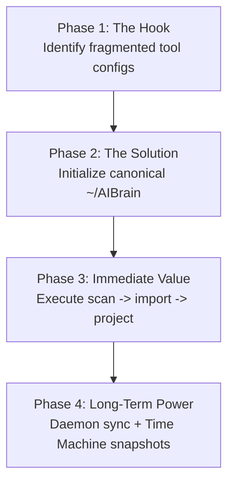

# Onboarding Guide — SYNAPSE
### llm-neuro-surgeon — Four-Phase Journey

Welcome to **SYNAPSE**. This guide walks you through the four phases of setting up and taking complete control of your AI tool configurations.



---

## Phase 1 — The Hook

You have more than one AI coding tool installed. Each tool keeps its own rules file, in its own format, in its own place. You've already copy-pasted the same instructions into two or three of them this month.

That's the problem SYNAPSE exists to remove.

> [!WARNING]
> Maintaining separate `CLAUDE.md`, `.cursorrules`, `GEMINI.md`, and `.windsurfrules` files leads to configuration drift, stale skills, and fragmented model knowledge across your workspace.

---

## Phase 2 — The Solution

> **The Brain.** One canonical, git-backed directory — `~/AIBrain` — holding every skill, rule, agent, and MCP server you use. Every tool on your machine reads from it, directly or through a generated file. Edit once. Every model stays equally skilled.

```text
~/AIBrain/
├── skills/<slug>/          # SKILL.md + skill.yaml
├── agents/<slug>.md        # Canonical agent definitions
├── rules/                  # global.md + scoped/<glob>.md
├── memory/                 # MEMORY.md + topic files
├── prompts/                # Reusable command templates
├── mcp/servers/<id>.yaml   # Transports & env placeholders
├── .brain/                 # Active state & mappings.json
└── .git/                   # Full Git history (Time Machine)
```

---

## Phase 3 — Immediate Value (The Three-Command Loop)

```bash
# 1. Discover installed tools (read-only)
synapse scan

# 2. Ingest existing configs (dry-run first)
synapse import --dry-run
synapse import

# 3. Project Brain back out to all tools
synapse project
```

> [!TIP]
> Run `synapse scan` first. It is read-only and takes seconds. `synapse import --dry-run` shows you exactly what will move into the Brain before anything happens — expect it to report something like:
> `"Ingesting 7 skills, 6 agents, 2 rules, 3 MCP servers into ~/AIBrain"`.

From here, `synapse project` pushes the Brain's contents back out to every tool it found. That's the whole loop: **scan → import → project.**

---

## Phase 4 — Long-Term Power

Once your Brain is initialized, unlock long-term features:

| Feature | Command | Benefits |
|---|---|---|
| ⏳ **Time Machine** | `synapse snapshot "msg"` | Every sync is a Git commit. Revert anytime with `synapse rollback <hash>`. |
| 🔄 **Auto-Sync** | `synapse sync` | Watches the Brain and all tools; resolves drift with a 3-way merge in real time. Add `--once` for a single pass instead of staying running. |
| 🩺 **Doctor Auto-Repair** | `synapse doctor --fix` | Diagnoses broken symlinks and config drift, repairing them automatically. |
| 🔌 **MCP Key Protection** | `synapse mcp harvest` | Browse MCP servers; API keys stay securely in the OS Keychain via `${VAR}` placeholders. |
| 🛒 **Marketplace** | `synapse marketplace` | Pull skills and agents from any Git repo (`anthropics/skills`), with SHA-256 provenance cards. |

---

> [!NOTE]
> Read the full [docs/USER_GUIDE.md](USER_GUIDE.md) for complete CLI, Desktop GUI, MCP Hub, and Doctor documentation.
