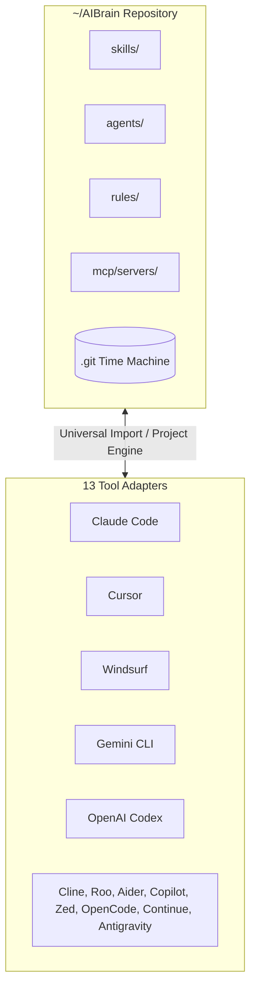
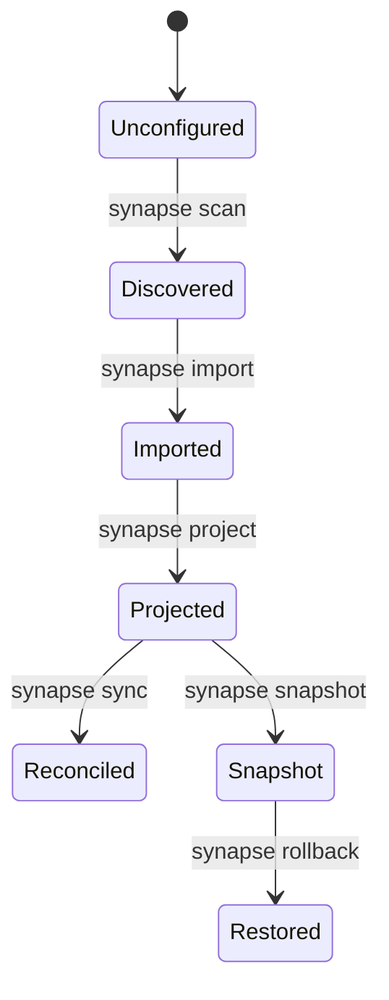
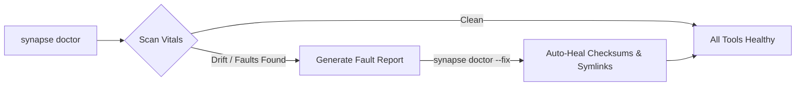

# SYNAPSE User Guide
### llm-neuro-surgeon — One Brain. All Models.

Welcome to the **SYNAPSE** User Guide. This document provides a complete reference for managing your AI coding tool configurations using the `synapse` (or `neurosurgeon`) CLI and the React desktop application.

---

## Table of Contents

1. [Core Concepts](#1-core-concepts)
2. [CLI Command Reference](#2-cli-command-reference)
   - [synapse scan](#synapse-scan)
   - [synapse import](#synapse-import)
   - [synapse project](#synapse-project)
   - [synapse sync](#synapse-sync)
   - [synapse doctor](#synapse-doctor)
   - [synapse snapshot & rollback](#synapse-snapshot--rollback)
   - [synapse exec & filter](#synapse-exec--filter-synaptic-auto-compression)
   - [synapse spool](#synapse-spool)
   - [synapse mcp](#synapse-mcp)
   - [synapse marketplace](#synapse-marketplace)
3. [Supported Tool Adapters (13/13)](#3-supported-tool-adapters-1313)
4. [Desktop GUI Application](#4-desktop-gui-application)
5. [MCP Registry & Marketplace](#5-mcp-registry--marketplace)
6. [Doctor Diagnostic Engine](#6-doctor-diagnostic-engine)
7. [Troubleshooting & FAQ](#7-troubleshooting--faq)

---

## 1. Core Concepts

SYNAPSE unifies configuration management across all AI tools installed on your system using a single, Git-backed directory — **the Brain** (`~/AIBrain`).



> [!NOTE]
> **The Three-Command Loop:**  
> `synapse scan` → `synapse import` → `synapse project`.  
> Once imported into `~/AIBrain`, run `synapse sync` any time to reconcile drift in one pass.

### Inbuilt Obsidian Session Worklog Skill
Every freshly initialized or imported Brain automatically provisions the canonical `obsidian-session-worklog` skill into `~/AIBrain/skills/obsidian-session-worklog/` and projects it across all tools:
- **Automatic Vault Discovery**: Locates `$OBSIDIAN_VAULT_PATH` or fallback `~/Documents/My-Vault`.
- **Session Worklog Tracking**: Standardized markdown note creation at `${VAULT}/Worklog/AGY Sessions/YYYY-MM-DD - AI Session - ${CONVERSATION_ID}.md`.
- **Cross-Tool Projection**: Projected as `.claude/skills/`, `.cursor/rules/`, `.agents/skills/`, and `.continue/rules/` across all 13 coding assistants.

---

## 2. CLI Command Reference

Both binary names `synapse` and `neurosurgeon` can be used interchangeably.



### `synapse scan`
Discovers all AI coding tools installed across your home directory and active workspace.

```bash
synapse scan
```

### `synapse import`
Losslessly ingests tool configs into `~/AIBrain`. Always run with `--dry-run` first to preview changes.

```bash
synapse import --dry-run
synapse import
```

> [!TIP]
> `synapse import --dry-run` produces zero disk writes and displays a structured preview of skills, agents, rules, and MCP servers to be ingested.

### `synapse project`
Pushes Brain configurations back to every tool. Generates symlinks where supported, or stamped files marked `<!-- GENERATED BY SYNAPSE / LLM NEUROSURGEON — edit in the Brain -->`.

```bash
synapse project --dry-run
synapse project
```

### `synapse sync`
Runs one import + project reconciliation pass and exits. There is no watch
or daemon mode yet — `packages/core` has `watcher.rs` and `scheduler.rs`
modules for a future continuous-sync mode, but no CLI command wires them up,
so `synapse sync` always does a single pass today.

```bash
synapse sync
synapse sync --once   # accepted for forward compatibility; same behaviour
```

### `synapse doctor`
Diagnoses configuration drift, broken symlinks, or missing projections across all 13 tools.

```bash
# Health report
synapse doctor

# One-command auto-repair
synapse doctor --fix
```

### `synapse snapshot & rollback`
Marks deliberate history points in your Brain Git repository or restores working tree state.

```bash
# Take Git snapshot
synapse snapshot "Added Rust refactoring skill"

# Revert to snapshot revision
synapse rollback <commit-hash>
```

### `synapse exec & filter` (Synaptic Auto-Compression)
Executes arbitrary terminal commands or streams with intelligent sensory gating—reducing agent token consumption by ~95% while strictly preserving errors and stack traces.

```bash
# Wrap command execution with real-time semantic compression
synapse exec -- cargo test --workspace
synapse exec -- pnpm test:e2e
synapse exec -- pytest tests/

# Pipe standard input through the compression filter
cargo test 2>&1 | synapse filter --level aggressive
```

### `synapse spool`
Inspects, searches, or replays the local raw uncompressed execution logs.

```bash
# List all cached execution logs and token reduction ratios
synapse spool list

# Display full uncompressed log or filter by pattern
synapse spool show <id>
synapse spool show <id> --grep "panic"
synapse spool show <id> --tail 50
```

---

## 3. Supported Tool Adapters (13/13)

| Adapter | Native Config Locations | Import Strategy | Projection Output |
|---|---|---|---|
| **Claude Code / Desktop** | `CLAUDE.md`, `.claude/skills/`, `.claude/agents/`, `.mcp.json` | Full skills & agents parsing | Dedicated `.claude/` structure |
| **Gemini CLI** | `GEMINI.md`, `.gemini/settings.json` | Rules & settings | Stamped `GEMINI.md` |
| **OpenAI Codex CLI** | `.codex/config.toml`, `.codex/instructions.md` | Multi-agent rules | `AGENTS.md` + `.codex/` |
| **Cursor** | `.cursorrules`, `.cursor/rules/*.mdc` | MDC frontmatter globs | `.cursor/rules/` MDC files |
| **Windsurf** | `.windsurfrules`, `mcp_config.json` | Rules & MCP servers | `.windsurfrules` |
| **Cline** | `.clinerules`, `cline_mcp_settings.json` | Custom rules & servers | `.clinerules` |
| **Roo Code** | `.roomodes`, `.clinerules` | Mode rules | `.roomodes` |
| **Aider** | `CONVENTIONS.md`, `.aider.conf.yml` | Conventions & YAML | `CONVENTIONS.md` |
| **Continue** | `.continue/rules/*.md`, `.continue/config.json` | MDC rules & JSON | `.continue/rules/` |
| **GitHub Copilot** | `.github/copilot-instructions.md` | Scoped instructions | `.github/copilot-instructions.md` |
| **Zed** | `.rules`, `.zed/settings.json`, `AGENTS.md` | Settings & rules | `.rules` + `AGENTS.md` |
| **OpenCode** | `AGENTS.md` | Multi-agent rules | `AGENTS.md` |
| **Antigravity CLI** | `AGENTS.md`, `.agy/skills/`, `.gemini/settings.json` | Skills & settings | `AGENTS.md` + `.agy/skills/` |

---

## 4. Desktop GUI Application

The React desktop app has two screens, both backed by real reads against
your machine and Brain — nothing on either screen is sample data:

- **Intake** — runs every adapter's `detect()`/`import()` against the
  scanned site and charts what it finds, including the tools that
  *aren't* installed (absence is a finding, not an empty row).
- **Examination** — runs the Doctor's diagnostics and charts the result.
  Read-only: opening this screen calls `diagnose()`, never
  `apply_fixes()`, so it cannot change the Brain on its own.

Both render in the SYNAPSE brand system (ink/accent-blue palette,
square-cornered "blueprint" panels with corner registration marks, zero
emoji — `brands/synapse/tokens.json`). Every "Next" hint at the bottom
of a chart names the real CLI command that continues the workflow, so
the desktop app teaches the CLI rather than duplicating it.

There is no separate Config/Adapters/Vitals/Onboarding/Marketplace/MCP
Hub screen — those verbs are CLI-only for now (`synapse doctor`,
`synapse mcp`, `synapse marketplace`; see §2 and §5).

---

## 5. MCP Registry & Marketplace

### `synapse mcp`

```bash
# Search the official MCP registry (registry.modelcontextprotocol.io)
synapse mcp search filesystem

# Health-check a server yourself — running this command IS the explicit
# enable. A search result is never spawned or contacted on your behalf.
synapse mcp health "npx -y @modelcontextprotocol/server-filesystem"
synapse mcp health https://example.com/mcp
```

`mcp search` never executes anything it finds — a registry entry's
`command_or_url` is displayed, not run. Env vars a server declares
(`env_placeholders`) are shown by name only; no value is ever fetched
from the registry.

> [!NOTE]
> OS Keychain secret storage exists in the core library
> (`packages/core::secrets` — `harvest_env`, `OsKeychainStore`) but isn't
> wired into a CLI command yet. Today, `env_placeholders` are names you'd
> set yourself; there's no `synapse mcp harvest` verb.

### `synapse marketplace`

```bash
# List skill slugs from anthropics/skills, optionally filtered
synapse marketplace search
synapse marketplace search algo

# Fetch one skill's provenance, license, and executable-content flag
synapse marketplace show algorithmic-art
```

`marketplace show` fetches metadata only — description, license note,
SHA-256 of the skill content, and whether it ships files that look
executable (`.sh`, `.py`, `.js`, etc., flagged so you look before you
trust). Nothing is written into the Brain by either command; there's no
`synapse marketplace import` yet.

---

## 6. Doctor Diagnostic Engine

`synapse doctor` is a one-shot diagnostic pass over your Brain and its projections — configuration drift, orphaned symlinks, broken projections. There's no continuous-monitoring mode yet: run `synapse sync` any time you want drift reconciled, and `synapse doctor` any time you want to see what's wrong before deciding whether to fix it.



---

## 7. Troubleshooting & FAQ

> [!CAUTION]
> **Modifying Projected Files:**  
> Never edit projected files directly (e.g. `CLAUDE.md` stamped with generated headers). Always make edits inside `~/AIBrain` and run `synapse sync` (or `synapse project`) to project your changes back out.

### Common Questions

- **Where is my Brain located?**  
  By default, the Brain is stored at `~/AIBrain`. Override it by setting `NEUROSURGEON_BRAIN` (or pass `--brain <PATH>` to `synapse doctor`).
- **How do I roll back a bad configuration edit?**  
  Run `synapse rollback HEAD~1` to restore the previous Git snapshot of your Brain working tree.

---

**Next Steps:** Read [docs/ONBOARDING.md](ONBOARDING.md) for the 4-phase quickstart walkthrough or [docs/ADAPTER_AUTHORING_GUIDE.md](ADAPTER_AUTHORING_GUIDE.md) to author a new tool adapter in Rust.
